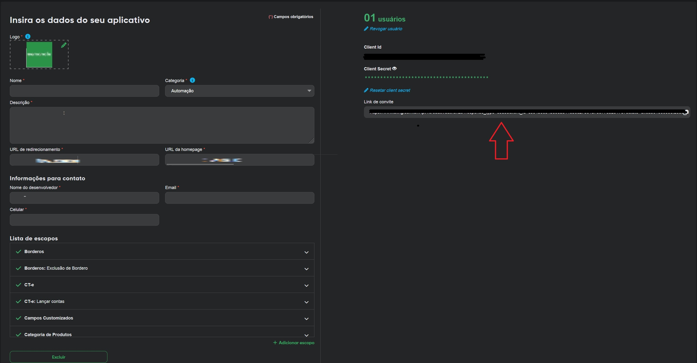

# - Português

## Descrição

Exemplo simples de código para a autenticação com a nova `API do Bling (V3)` utilizando Python.

Pode ser configurado para armazenar os dados em formato JSON ou utilizando o redis, alterando o valor da variável `TOKENS_STORAGE_METHOD` no `config.py`. O padrão é utilizar o `JSON`

Um exemplo de uso está no arquvio `example_usage.py`.

-------------------------------------

Importante: o refresh token tem uma validade de 30 dias, conforme documentação da API [https://developer.bling.com.br/aplicativos#refresh-token](https://developer.bling.com.br/aplicativos#refresh-token), 

-------------------------------------


## Instalação versão com JSON

```bash
git clone https://github.com/TempoNaoTenho/bling_api_v3_auth.git
python -m venv venv
Linux (source venv/bin/activate) ou Windows(venv/Scripts/activate)
pip install -r requirements.txt
```
## Configuração inicial

- Crie um arquivo `.env` com as seguintes variáveis:

```bash
BLING_CLIENT_ID=SEU_CLIENT_ID
BLING_CLIENT_SECRET=SEU_CLIENT_SECRET
```

Para uso com redis, as variáveis do `.env` são REDIS_HOST_IP, REDIS_HOST_PORT, REDIS_PASSWOR


## Obter os tokens:

- O `client_id` e `client_secret` são obtidos ao cadastrar aplicativo na sua conta do Bling. Veja o link [https://developer.bling.com.br/aplicativos](https://developer.bling.com.br/aplicativos)


- O `code` necessário para a primeira execução do script é obtido através do endereço "Link do convite" da sua conta do Bling


- Com o `code` você tem 1 minuto para obter o `refresh token`. (Neste ponto é só rodar o script e colar o code ou passar o parâmetro para a função `get_tokens_from_bling_using_code_in_url(code)`).

## Executar o script

```bash
cd app
python example_usage.py
```

# - English

## Description

Exemple of code to authenticate with the new `Bling (V3) API` using Python.

It can be configured to store the data in JSON format or using redis, changing the value of the variable `TOKENS_STORAGE_METHOD` in `config.py`. The default is to use JSON

An example of usage is in the file `example_usage.py`.

-------------------------------------

Important: the refresh token has a validity of 30 days according to the Bling API [https://developer.bling.com.br/aplicativos#refresh-token](https://developer.bling.com.br/aplicativos#refresh-token),

-------------------------------------


## Install

```bash
git clone https://github.com/TempoNaoTenho/bling_api_v3_auth.git
python -m venv venv
Linux (source venv/bin/activate) or Windows(venv/Scripts/activate)
pip install -r requirements.txt
```

## Configuration

- Create an `.env` file with the following variables:

```bash
BLING_CLIENT_ID=YOUR_CLIENT_ID
BLING_CLIENT_SECRET=YOUR_CLIENT_SECRET
```

For use with redis, the variables in the `.env` file are REDIS_HOST_IP, REDIS_HOST_PORT, REDIS_PASSWORD


## Get tokens:

- The `client_id` and `client_secret` are obtained when registering your app on Bling. See the link [https://developer.bling.com.br/aplicativos](https://developer.bling.com.br/aplicativos)


- The `code` is required to get the `refresh token`. (At this point, you can run the script and paste the code or pass the parameter to the function `get_tokens_from_bling_using_code_in_url(code)`).

## Run the script

```bash
cd app
python example_usage.py
```

